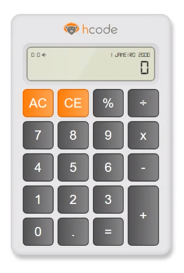

# calculadora-typescript
>Projeto de uma calculadora desenvolvido no curso "Dominando TypeScript" 
> 
>>Ministrado pela HCode na plataforma Udemy https://www.udemy.com/course/curso-online-typescript/

## Protótipo de Interface do Usuário

## Meta
><b>Cristiano Mendonça Gueivara</b> 
>
>>

><b>Licença:</b>  Distribuído sobre a licença `Software Livre`. Veja Licença **[ISC](https://opensource.org/license/isc-license-txt/)**. para mais informações.

